# 🚀 Awesome Sales Enablement Platform

<p align="center">
  <a href="https://github.com/ishandutta2007/Awesome-Awesome-Awesome"></a>
  <a href="https://discord.gg/jc4xtF58Ve"></a>
  <a href="https://github.com/ishandutta2007/Awesome-Sales-Enablement-Platform/stargazers"></a>
  <a href="https://github.com/ishandutta2007/Awesome-Sales-Enablement-Platform/blob/main/LICENSE"></a>
  <a href="http://makeapullrequest.com"></a>
  <a href="https://github.com/ishandutta2007"></a>
</p>

<p align="center">
  
</p>

## 📌 Curated Ecosystem for Sales Enablement & Revenue Acceleration

> A curated list of leading **SaaS platforms** and **open-source GitHub repositories** for **Sales Enablement, Revenue Readiness, AI Sales Coaching, Content Governance, Guided Selling, and Seller Onboarding**.

**Last updated: September 2026**

---

## 📖 Table of Contents

- [🌐 Market Overview & Ecosystem Dynamics](#-market-overview--ecosystem-dynamics)
- [🏢 SaaS & Hosted Commercial Platforms](#-saas--hosted-commercial-platforms)
- [🔓 Open-Source GitHub Projects](#-open-source-github-projects)
- [🏗️ Open-Source Sales Enablement Stack Blueprint](#️-open-source-sales-enablement-stack-blueprint)
- [🤝 How to Contribute](#-how-to-contribute)
- [📈 Star History](#-star-history)
- [⚖️ Disclaimer](#️-disclaimer)

---

## 🌐 Market Overview & Ecosystem Dynamics

> 📊 **Estimated Market Size & Structure**: The global Sales Enablement Platform market is estimated at **~$4.8 Billion** and is projected to surpass **$12.5 Billion by 2031** (~19.5% CAGR). The sector is **moderately concentrated at the high-end enterprise tier** (evidenced by major consolidation such as Seismic + Highspot and Showpad + Bigtincan creating dominant $200M–$600M ARR powerhouses), while remaining **moderately fragmented across mid-market, interactive demo, and specialized AI coaching / video readiness niches**.

---

## 🏢 SaaS & Hosted Commercial Platforms

The commercial sales enablement landscape features end-to-end suites delivering content governance, digital sales rooms (DSR), conversational intelligence, and AI-assisted guided selling.

| Product | Valuation / Revenue | Description | Starting Pricing | Free Tier / Trial Limits |
| :--- | :--- | :--- | :--- | :--- |
| **[Highspot](https://www.highspot.com/)** | 💰 **~$3.5B Valuation**<br>*(~$450M ARR; merged with Seismic in ~$600M ARR combo)* | 🎯 Content-centric enablement platform recognized for AI-powered semantic search, Smart Pages, buyer engagement analytics, and unified seller experience. | ~$45 – $65 / user / month *(annual billing; typical entry contract starts ~$15,000–$25,000/year)* | No free forever plan; 14 to 30-day scoped pilot/sandbox trial upon enterprise qualification |
| **[Seismic](https://seismic.com/)** | 💰 **~$3.0B Valuation**<br>*(~$400M ARR)* | 🏢 Enterprise-grade sales enablement platform known for rigorous content governance, automated document assembly, guided selling, and deep CRM integrations. | ~$30 – $60 / user / month *(annual contract; typical enterprise deployment starts ~$20,000/year)* | No free forever plan; 14-day guided proof-of-concept / pilot available upon sales qualification |
| **[Mindtickle](https://www.mindtickle.com/)** | 💰 **~$1.2B Valuation**<br>*(~$118M ARR)* | 🧠 Comprehensive sales readiness and revenue productivity platform integrating structured onboarding, video coaching, call intelligence, and skill gap analytics. | ~$8 – $17 / user / month *($100–$200/user/year base readiness tier, min. annual contract typically $10,000+)* | No free forever plan; 14-day sales-guided sandbox evaluation for qualified enterprise accounts |
| **[Showpad](https://www.showpad.com/)** | 💰 **~$1.0B Valuation**<br>*(~$145M ARR; merged with Bigtincan under Vector Capital)* | 📱 Leading visual and field enablement platform optimized for interactive tablet/mobile presentations, shared spaces, and buyer content engagement. | ~$35 – $65 / user / month *(Essential/Professional tiers, billed annually)* | No free forever plan; 14-day assisted proof-of-concept trial upon demo request |
| **[Allego](https://www.allego.com/)** | 💰 **~$300M–$500M Est. Valuation**<br>*(~$130M–$196M Revenue)* | 🎥 Video-first learning, coaching, and enablement suite built for rapid asynchronous pitch practice, interactive role-playing, and call analysis. | ~$25 – $60 / user / month *(tiered by seller vs. non-seller seats, billed annually)* | No free forever plan; 14 to 30-day sales-approved enterprise sandbox trial |
| **[Mediafly](https://www.mediafly.com/)** | 💰 **~$150M–$250M Est. Valuation**<br>*(~$30M–$40M ARR; $193M Total Funding)* | 💼 Revenue enablement and interactive presentation platform supporting ROI calculators, dynamic sales plays, and sophisticated content analytics. | ~$30 – $50 / user / month *(annual contract; typical minimum seat tier of 10–25 users)* | No free forever plan; 14-day interactive content assessment sandbox upon demo request |
| **[Bigtincan](https://www.bigtincan.com/)** | 💰 **~A$183M ($120M USD) Acq. Value**<br>*(~$78M–$100M+ Revenue; merged with Showpad)* | 🌍 Mobile-first enablement and automation platform specialized for complex distributed workforces, offline access, and field sales teams. | ~$25 – $45 / user / month *(Content Hub & Learning Hub starting tiers, billed annually)* | No free forever plan; 14-day custom scoped proof-of-concept trial upon sales consultation |
| **[SalesHood](https://saleshood.com/)** | 💰 **~$50M–$100M Est. Valuation**<br>*(~$15M–$21M ARR)* | ⚡ Rapidly deployable mid-market enablement platform focusing on peer-to-peer coaching, guided sales plays, training cadences, and content hubs. | ~$45 – $50 / user / month *(Essential edition, billed annually; Guided Selling add-on from $5/user/month)* | No free forever plan; 30-day free trial available *(full access to core enablement and coaching features)* |
| **[Pitcher](https://www.pitcher.com/)** | 💰 **~$50M–$80M Est. Valuation**<br>*(~$15M–$25M ARR)* | 📊 SuperApp for sales enablement offering compliant closed-loop interactive presentations, ERP/CRM synchronization, and guided field selling. | ~$20 – $35 / user / month *(SuperApp base starting edition, billed annually)* | No free forever plan; 14-day sales-guided proof-of-concept sandbox trial |
| **[Paperflite](https://www.paperflite.com/)** | 💰 **~$30M–$50M Est. Valuation**<br>*(~$15M–$21M ARR)* | 📄 Content experience and collateral distribution platform enabling reps to curate personalized content micro-sites and track buyer interaction heatmap data. | $30 / user / month *(Starter plan billed annually, min. 5 users; $39/user/month billed monthly)* | No free forever plan; 14 to 15-day free trial *(no credit card required, up to 5 user test seats)* |

---

## 🔓 Open-Source GitHub Projects

Open-source solutions empower engineering and RevOps teams to build custom, self-hosted, and sovereign sales enablement architectures without vendor lock-in.

*Sorted descending by GitHub stargazers count:*

1. **[AppFlowy](https://github.com/AppFlowy-IO/AppFlowy)** [](https://github.com/AppFlowy-IO/AppFlowy/stargazers)  
   ✨ Open-source, self-hosted collaborative workspace and Notion alternative — ideal for building internal sales wikis, pitch playbooks, competitor battlecards, and customer-facing project notes.

2. **[AFFiNE](https://github.com/toeverything/AFFiNE)** [](https://github.com/toeverything/AFFiNE/stargazers)  
   🎨 Next-generation all-in-one knowledge base and visual whiteboard — perfect for visual discovery workshops, deal room mapping, and interactive collaborative pitch planning.

3. **[Twenty](https://github.com/twentyhq/twenty)** [](https://github.com/twentyhq/twenty/stargazers)  
   💼 Modern, extendable open-source CRM and sales operating system designed to provide full data control and natively connect reps to playbooks and deals.

4. **[Flowise](https://github.com/FlowiseAI/Flowise)** [](https://github.com/FlowiseAI/Flowise/stargazers)  
   🤖 Drag-and-drop UI to build customized LLM flows — used to deploy custom AI role-play simulators, objection-handling bots, and real-time playbook retrieval agents for sellers.

5. **[Cal.com](https://github.com/calcom/cal.com)** [](https://github.com/calcom/cal.com/stargazers)  
   📅 Open-source scheduling infrastructure enabling sales teams to streamline demo routing, SDR-to-AE handoffs, and qualification meeting bookings.

6. **[Outline](https://github.com/outline/outline)** [](https://github.com/outline/outline/stargazers)  
   📚 Blazing fast, intuitive open-source team knowledge base — standard tool for hosting governed sales playbooks, objection scripts, product FAQs, and battle cards.

7. **[Chatwoot](https://github.com/chatwoot/chatwoot)** [](https://github.com/chatwoot/chatwoot/stargazers)  
   💬 Open-source omnichannel buyer engagement and customer communication platform for real-time seller chat, inbound qualification, and buyer assistance.

8. **[Wiki.js](https://github.com/requarks/wiki)** [](https://github.com/requarks/wiki/stargazers)  
   📖 Feature-rich, highly configurable open-source wiki engine with Git storage backends, Markdown/rich-text support, and granular permission controls for sales documentation.

9. **[Activepieces](https://github.com/activepieces/activepieces)** [](https://github.com/activepieces/activepieces/stargazers)  
   ⚡ Open-source no-code business automation tool — seamlessly routes collateral, triggers enablement notifications in Slack/Discord, and automates CRM workflows.

10. **[BookStack](https://github.com/BookStackApp/BookStack)** [](https://github.com/BookStackApp/BookStack/stargazers)  
    📑 Simple, opinionated open-source documentation system structured like Books, Chapters, and Pages — ideal for organizing step-by-step seller certification guides.

11. **[Documenso](https://github.com/documenso/documenso)** [](https://github.com/documenso/documenso/stargazers)  
    ✍️ The open-source DocuSign alternative — provides verifiable electronic signatures, automated agreement generation, and proposal closing workflows for sales reps.

12. **[Formbricks](https://github.com/formbricks/formbricks)** [](https://github.com/formbricks/formbricks/stargazers)  
    📋 Privacy-first experience management and micro-survey platform — measures buyer readiness, demo satisfaction, and seller training efficacy.

13. **[Typebot](https://github.com/baptisteArno/typebot.io)** [](https://github.com/baptisteArno/typebot.io/stargazers)  
    🛠️ Visual conversational form and chatbot builder — qualifies leads, dispenses relevant case studies dynamically, and schedules prospect meetings.

14. **[Moodle](https://github.com/moodle/moodle)** [](https://github.com/moodle/moodle/stargazers)  
    🎓 Battle-tested open-source learning management system (LMS) used globally for structured seller onboarding curriculum, compliance quizzes, and multi-tier certifications.

15. **[Frappe LMS](https://github.com/frappe/lms)** [](https://github.com/frappe/lms/stargazers)  
    🧑‍🏫 Modern, lightweight open-source LMS built on Python/Frappe framework — excellent for modular sales onboarding courses, tracking completion rates, and lesson checklists.

16. **[Vrite](https://github.com/vriteio/vrite)** [](https://github.com/vriteio/vrite/stargazers)  
    📝 Open-source collaborative developer content platform with Kanban workflows — suited for engineering-heavy revenue teams producing technical battlecards and API sales collateral.

---

## 🏗️ Open-Source Sales Enablement Stack Blueprint

```
+-----------------------------------------------------------------------------------+
|                        CUSTOM REVENUE ENABLEMENT ARCHITECTURE                     |
+-----------------------------------------------------------------------------------+
|  1. COLLATERAL & PLAYBOOKS  |  Outline / BookStack / AppFlowy / AFFiNE             |
|  2. ONBOARDING & TRAINING   |  Frappe LMS / Moodle (Quizzes & Certifications)     |
|  3. CONVERSATIONAL AI & BOT |  Flowise (RAG over Playbooks) + Typebot             |
|  4. SALES SCHEDULING & CRM  |  Cal.com + Twenty CRM                               |
|  5. PROPOSALS & CONTRACTS   |  Documenso (E-Signatures & Deal Room Agreements)    |
|  6. WORKFLOW & INTEGRATION  |  Activepieces (Slack / Webhook automation)          |
+-----------------------------------------------------------------------------------+
```

---

## 🤝 How to Contribute

Contributions are highly encouraged! To add or refine entries:

1. 🍴 **Fork the repository**.
2. ✍️ **Add or update entries** in `README.md` following the standard table/list formats.
3. 🔗 **Include verified data**: links, concise descriptions, starting pricing tiers, and precise free trial/tier limits.
4. 🚀 **Submit a Pull Request** with a clear explanation of changes.

---

## 📈 Star History

[](https://star-history.dera.page/#ishandutta2007/Awesome-Sales-Enablement-Platform&type=date&legend=top-left)

---

## ⚖️ Disclaimer

- ℹ️ This is a **community-curated index** for educational and reference purposes and does not constitute formal commercial endorsement.
- 🛡️ Sales enablement materials, pricing calculators, and competitive battlecards contain company messaging and compliance risk. Self-hosted deployments require adequate access governance, encryption, and regular content audits.

---

<p align="center">
  <sub>Built with ❤️ for Revenue Leaders, Sales Operations, and Growth Teams.</sub>
</p>
